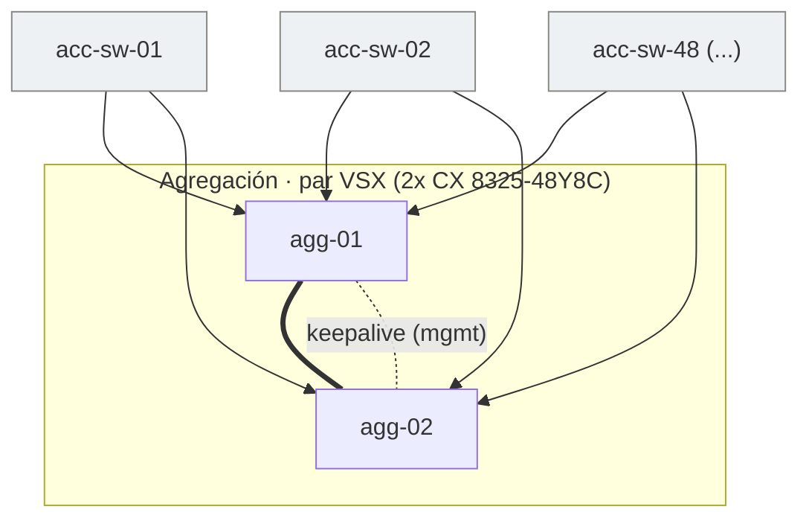

# Fabric de switching — VSX + MC-LAG

Cada switch de acceso sube con un **MC-LAG de 2 enlaces** (uno a cada nodo VSX,
ambos activos). Los dos 8325 forman un **par VSX** unido por el **ISL**; el
keepalive va por la red de gestión. No hay enlaces directos entre switches de
acceso: cada uno es independiente y sube al par.

- El enlace grueso `agg-01 === agg-02` es el **ISL** (2× 100G) que sincroniza el par.
- Cada flecha de un switch de acceso a un nodo es **un miembro del MC-LAG**; se
  muestran 3 representativos de los **48**.
- Cada nodo 8325 termina **48 enlaces** (uno por switch de acceso): por eso el modelo
  de 48 puertos de fibra es el correcto.
