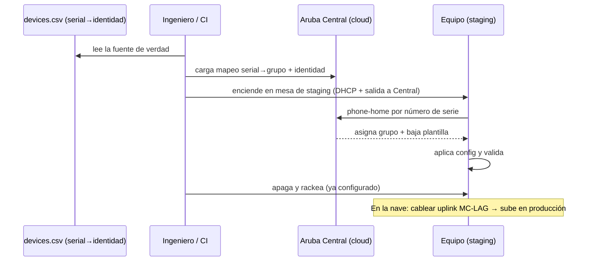

# Flujo de aprovisionamiento (ZTP + staging)

El equipo se provisiona **en bodega, antes de rackear**: se claimea por número de
serie contra Aruba Central, baja su plantilla, se valida y se apaga. Llega a la nave
ya configurado, de modo que la semana de apertura es "rackear y enchufar".

El claim lo orquesta `scripts/claim_devices.py`, que recorre `devices.csv` y, por
cada equipo, ejecuta el ciclo de arriba contra la API de Central (o el backend
simulado, que genera la evidencia sin equipos reales).
