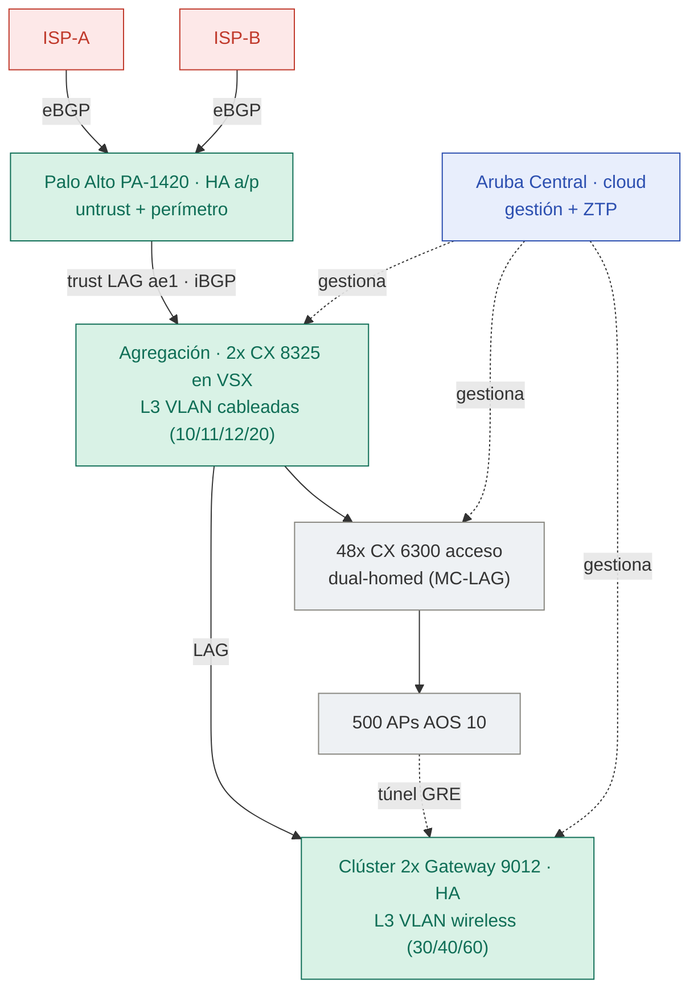

# Topología general

Arquitectura del nuevo sector del CD: doble ISP directo al firewall (perímetro),
el par **VSX** como agregación y L3 de las VLAN cableadas, el clúster **9012** como
L3 de las VLAN wireless (tráfico en túnel desde los APs), y **Aruba Central**
gestionando todo el fleet desde la nube.

Los tres bloques resaltados en verde (**firewall, VSX, 9012**) son los puntos donde
vive el enrutamiento L3. El tráfico de usuario wireless viaja en **túnel GRE** desde
los APs hasta el clúster 9012; Aruba Central no está en la ruta de datos, solo
gestiona.
